## 👨‍🏫 Autor e Informações Acadêmicas
- **Professora:** Márcia Bissaco
- **Instituição:** FATEC Ferraz de Vasconcelos — Faculdade de Tecnologia de Ferraz de Vasconcelos
- **Curso:** Análise e Desenvolvimento de Sistemas
- **Disciplina:** Visão Computacional

# Seminário e Projetos: Visão Computacional e Processamento de Imagens

> **Data Limite de Conclusão / Apresentação:** 28 de novembro de 2026 às 23:59  
> **Área:** Visão Computacional, Processamento Digital de Imagens e Inteligência Artificial de Borda (Edge AI)

---

## 🗺️ Mapa de Documentos do Repositório

Este repositório reúne diretrizes acadêmicas, análises aprofundadas de artigos científicos, modelos de projetos aplicados e propostas para Iniciação Científica (PIBIC/PIBITI) e TCC:

| Documento | Foco Principal | Finalidade e Destaques |
| :--- | :--- | :--- |
| 📄 [artigo-cientifico-sobre-TensorFlow.md](/artigo-cientifico-sobre-TensorFlow.md) | Artigo Seminal de Infraestrutura de IA | Análise completa de Abadi et al. (OSDI '16), grafos de dados, benchmarks com Inception-v3, escalabilidade multi-GPU e crítica comparativa contra o PyTorch. |
| 👁️ [exemplos-reconhecimento-facial-como-mouse.md](/exemplos-reconhecimento-facial-como-mouse.md) | Tecnologia Assistiva & IHC | Formulação matemática de Head Pose (PnP), cálculo de EAR para piscadas, estabilização via 1€ Filter e testes com a Lei de Fitts (ISO 9241-9). |
| 🔬 [sugestao-iniciacao-cientifica.md](/sugestao-iniciacao-cientifica.md) | Projetos Móveis para PIBIC / TCC | Pipeline de desenvolvimento Edge AI com TensorFlow Lite, quantização INT8, hipóteses científicas e 3 projetos práticos (Agronegócio, Ergonomia e Acessibilidade). |
| 💡 [sugestao-nichos-inexplorados.md](/sugestao-nichos-inexplorados.md) | Inovação e Ineditismo Científico | Catálogo de 12 nichos inexplorados, alerta crítico sobre Comitê de Ética em Pesquisa (CEP), matriz taxonômica e ideias de vanguarda (rPPG, visão neuromórfica e documentoscopia). |
| 📋 [template-apresentacao-seminario.md](/template-apresentacao-seminario.md) | Roteiro Slide a Slide para Apresentação | Template pronto estruturado nos 10 tópicos exigidos, com distribuição de tempo, falas sugeridas e antecipação de perguntas da banca. |

---

## 📌 Instruções Oficiais do Seminário

Cada grupo deverá selecionar um artigo científico relacionado à **Visão Computacional e/ou Processamento de Imagens** para realizar uma apresentação. A ideia é que o grupo não apenas apresente o artigo, mas mostre que compreendeu o problema, as técnicas utilizadas, como o trabalho foi desenvolvido e quais foram os resultados encontrados pelos autores.

### Estrutura Obrigatória da Apresentação (10 Tópicos)

1. **Identificação do artigo**
   - Título;
   - Autores;
   - Ano de publicação;
   - Nome da revista, congresso ou periódico.
2. **Objetivo**
   - Qual é o objetivo do trabalho?
   - Qual problema os autores estão tentando resolver?
3. **Introdução**
   - Contextualização do tema;
   - Definição do problema;
   - Soluções existentes;
   - Limitações dessas soluções.
4. **Metodologia**
   - Explicar, de forma clara e passo a passo, como o trabalho foi realizado;
   - Mostrar as imagens e os dados utilizados;
   - Apresentar as técnicas de processamento de imagens e/ou Visão Computacional;
   - Informar os algoritmos, modelos, softwares e ferramentas computacionais utilizados, quando apresentados no artigo.
5. **Resultados**
   - Apresentar e explicar os principais resultados;
   - Mostrar as imagens, gráficos, tabelas e comparações apresentadas pelos autores;
   - Destacar os principais resultados obtidos.
6. **Discussão**
   - Apresentar a interpretação dos resultados feita pelos autores;
   - Destacar vantagens, limitações e possíveis aplicações do trabalho.
7. **Conclusão**
   - Apresentar as principais conclusões dos autores;
   - Comentar se o objetivo proposto foi alcançado.
8. **Opinião do grupo**
   - O grupo poderá apresentar sua própria análise sobre o trabalho, destacando pontos positivos, limitações, possíveis melhorias ou aplicações.
9. **Artigos complementares**
   - É permitido utilizar outros artigos para complementar a apresentação, fazer comparações ou explicar melhor alguma técnica.
10. **Referências**
    - Apresentar todos os artigos e demais fontes utilizadas.

---

## ⚠️ Atenção às Imagens e Citações

* As imagens, gráficos, tabelas e informações retiradas dos artigos devem ser devidamente citados.
* Sempre que possível, utilizem as figuras e imagens apresentadas pelos próprios autores, principalmente para explicar a metodologia e os resultados.
* Em cada slide, coloquem a fonte das informações ou imagens utilizadas.

**Exemplo geral:**
> *Fonte: Silva et al. (2023).*

**Para uma figura específica:**
> *Fonte: Silva et al. (2023), Figura 4.*

---

## ⏱️ Gestão de Tempo Sugerida (Apresentação de 15 a 20 Minutos)

Para evitar estouro de tempo ou penalizações da banca:

```mermaid
gantt
    title Distribuição de Tempo da Apresentação (Total: 18 min)
    dateFormat X
    axisFormat %s min
    Identificação e Objetivo (Itens 1-2) :0, 2
    Introdução e Limitações (Item 3) :2, 5
    Metodologia e Arquitetura (Item 4) :5, 10
    Resultados e Discussão (Itens 5-6) :10, 14
    Conclusão e Opinião Crítica (Itens 7-8) :14, 17
    Artigos Complementares e Referências (Itens 9-10) :17, 18
```

* **Itens 1 e 2 (Identificação e Objetivo):** 2 minutos (rápido e objetivo).
* **Item 3 (Introdução e Problema):** 3 minutos (contextualizar o gargalo da área).
* **Item 4 (Metodologia):** 5 minutos (**coração da apresentação**: diagramas e algoritmos).
* **Itens 5 e 6 (Resultados e Discussão):** 4 minutos (tabelas, gráficos e comparações).
* **Itens 7 e 8 (Conclusão e Opinião Crítica do Grupo):** 3 minutos (**momento de destaque da nota**).
* **Itens 9 e 10 (Complementares e Referências):** 1 minuto (fechamento formal).

---

## 💡 Dicas de Excelência para os Slides

* **Menos Texto, Mais Representação Visual:** Evitem colocar parágrafos nos slides. Utilizem diagramas de blocos, gráficos dos autores, esquemas de fluxo e palavras-chave.
* **Contar a História do Artigo:** O mais importante é que o grupo consiga contar a narrativa científica:
  1. *Qual era a dor no mundo real/acadêmico?*
  2. *Por que as abordagens anteriores falhavam?*
  3. *Qual foi o "pulo do gato" metodológico dos autores?*
  4. *Os números sustentam as conclusões?*
  5. *O que a área aprendeu com isso?*

---

## ✅ Checklist Pré-Apresentação do Grupo

- [ ] Todos os 10 tópicos obrigatórios possuem um slide correspondente dedicado?
- [ ] Todas as figuras e tabelas contêm a fonte explícita (*ex: Fonte: Abadi et al., 2016, Fig. 3*)?
- [ ] O grupo preparou a seção de **Opinião Crítica** com argumentos técnicos (e não apenas elogios genéricos)?
- [ ] A terminologia de Visão Computacional está correta (convolução, tensores, landmarks, acurácia, latência)?
- [ ] O tempo total de ensaio foi cronometrado entre 15 e 18 minutos?
