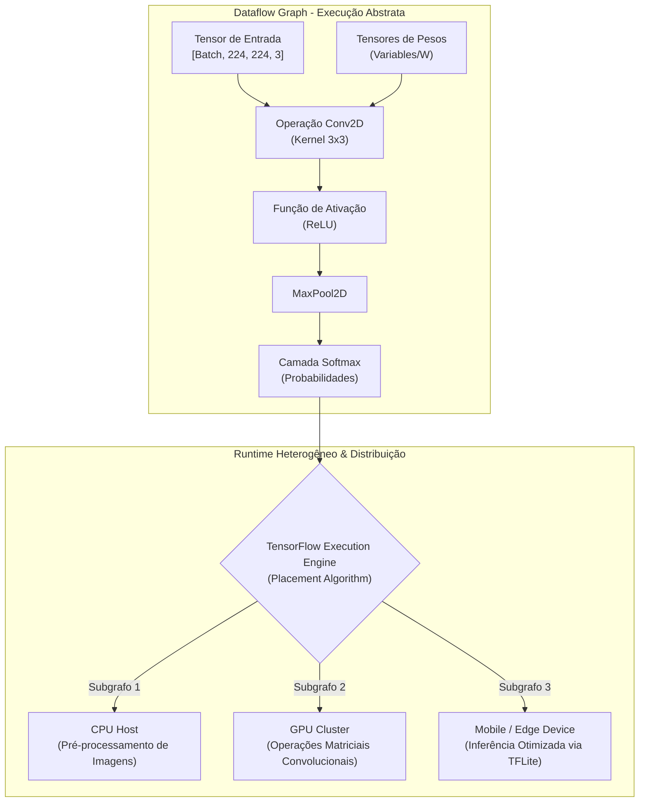

# Seminário Científico: TensorFlow em Visão Computacional

> **Síntese Acadêmica e Guia para Apresentação**  
> Artigo analisado: *"TensorFlow: Large-Scale Machine Learning on Heterogeneous Distributed Systems"* (Abadi et al., Google Brain).  
> Alinhado às 10 diretrizes do seminário de Visão Computacional e Processamento de Imagens.

---

## 🧭 Índice do Documento
1. [Identificação do Artigo](#1-identificação-do-artigo)
2. [Objetivo e Problema](#2-objetivo-e-problema)
3. [Introdução e Contexto](#3-introdução-e-contextualização)
4. [Metodologia e Arquitetura do Sistema](#4-metodologia-e-arquitetura-do-sistema)
5. [Resultados Experimentais](#5-resultados-experimentais-do-artigo)
6. [Discussão](#6-discussão-técnica)
7. [Conclusão dos Autores](#7-conclusão-dos-autores)
8. [Análise Crítica e Opinião do Grupo](#8-análise-crítica-e-opinião-do-grupo)
9. [Artigos Complementares](#9-artigos-complementares-e-evolução-da-área)
10. [Referências Bibliográficas](#10-referências-bibliográficas)
11. [Roteiro de Slides Sugerido](#11-roteiro-de-slides-sugerido-10-slides)

---

## 1. Identificação do Artigo

* **Título Original:** *TensorFlow: Large-Scale Machine Learning on Heterogeneous Distributed Systems*  
  *(Versão estendida da conferência USENIX OSDI '16: "TensorFlow: A System for Large-Scale Machine Learning")*
* **Autores:** Martín Abadi, Ashish Agarwal, Paul Barham, Eugene Brevdo, Zhifeng Chen, Craig Citro, Greg S. Corrado, Andy Davis, Jeffrey Dean, Matthieu Devin, Sanjay Ghemawat, Ian Goodfellow, Andrew Harp, Paul Tucker, Vincent Vanhoucke, Vijay Vasudevan, Fernanda Viégas, Oriol Vinyals, Pete Warden, Martin Wattenberg, Martin Wicke, Yuan Yu, Xiaoqiang Zheng (Google Brain).
* **Ano de Publicação:** 2015 (Disponibilizado inicialmente via [arXiv:1603.04467](https://arxiv.org/abs/1603.04467) e consolidado no [USENIX OSDI 2016](https://www.usenix.org/conference/osdi16/technical-sessions/presentation/abadi)).
* **Veículo de Publicação:** USENIX Symposium on Operating Systems Design and Implementation (OSDI) / Cornell University arXiv.
* **Acesso Oficial:** [Google Research Publication](https://research.google/pubs/tensorflow-large-scale-machine-learning-on-heterogeneous-distributed-systems/).

---

## 2. Objetivo e Problema

### Qual é o objetivo do trabalho?
Projetar e implementar uma infraestrutura flexível, portátil e de alto desempenho para treinamento e inferência de modelos de Aprendizado de Máquina em larga escala, capaz de operar tanto em um único dispositivo móvel (smartphone) quanto em clusters distribuídos contendo milhares de aceleradores de hardware heterogêneos (CPUs, GPUs e ASICs/TPUs).

### Qual problema os autores estão tentando resolver?
Antes do TensorFlow, pesquisadores enfrentavam uma dicotomia limitante:
1. **Ambientes de Pesquisa:** Eram dinâmicos e fáceis de programar (ex: Python puro, Torch com Lua), mas não escalavam com eficiência para produção e clusters industriais.
2. **Ambientes de Produção:** Eram hiperotimizados em baixo nível (como o antecessor *DistBelief* do Google), mas extremamente rígidos. Mudar a topologia de uma Rede Neural Convolucional (CNN) ou testar novas operações matemáticas exigia reescrever código complexo em C++ distribuído.
3. **Heterogeneidade de Hardware:** Não existia uma camada transparente que permitisse treinar um modelo de Visão Computacional em GPUs e embarcar o mesmo modelo idêntico em smartphones ou servidores sem reescrita total da arquitetura.

---

## 3. Introdução e Contextualização

A Visão Computacional passou por uma revolução paradigmática a partir de 2012, quando a rede AlexNet venceu a competição ImageNet utilizando Redes Neurais Convolucionais profundas (CNNs) executadas em GPUs. A partir desse ponto, o gargalo da Visão Computacional deixou de ser puramente matemático e tornou-se um **desafio de computação intensiva e engenharia de sistemas**.

Modelos de visão exigem a manipulação de tensores de alta dimensionalidade (imagens organizadas em formato $[Batch, Height, Width, Channels]$) e bilhões de operações multiplicativas por segundo (FLOPs).

### Limitações das Soluções Existentes (DistBelief, Caffe e Theano)
* **DistBelief (Google, 2011):** Baseado em redes de parâmetros em camadas rígidas. Não suportava grafos com laços de repetição, fluxos de controle dinâmicos ou cálculo automático e eficiente de gradientes para arquiteturas não convencionais.
* **Caffe (UC Berkeley):** Focado primariamente em Visão Computacional com arquivos de configuração de texto, mas com suporte distribuído rudimentar e pouca flexibilidade para tarefas multimodais.
* **Theano (MILA):** Pioneiro na diferenciação simbólica em grafos, mas limitado em escalabilidade distribuída e suporte a produção em nível empresarial.

---

## 4. Metodologia e Arquitetura do Sistema

O artigo formaliza a computação de aprendizado de máquina através de **Grafos Direcionados de Fluxo de Dados (Dataflow Graphs)**:

### Componentes Fundamentais da Metodologia
1. **Nós (Operações / Ops):** Representam unidades abstratas de computação (ex: `Conv2D`, `MatMul`, `Add`, `MaxPool`).
2. **Arestas (Tensores):** Representam matrizes multidimensionais de tipos primitivos (float32, int32) que fluem entre nós produtores e consumidores.
3. **Variáveis e Estado Persistente:** Tensores mutáveis que sobrevivem a múltiplas execuções do grafo, utilizados para armazenar os pesos convolucionais durante o treinamento com backpropagation.
4. **Algoritmo de Posicionamento (Placement Algorithm):** O runtime analisa o grafo e atribui automaticamente cada operação ao melhor hardware disponível (ex: copia tensores para a VRAM da GPU se o nó exigir convolução, ou mantém em CPU para I/O de arquivos de imagem).
5. **Diferenciação Automática (Autodiff):** O TensorFlow expande automaticamente o grafo para trás, inserindo nós de derivadas para cada operação primitiva, viabilizando o algoritmo de retropropagação sem erros manuais de cálculo diferencial.
6. **Comunicação entre Dispositivos:** Se dois nós conectados estão em GPUs ou máquinas distintas, o TensorFlow injeta automaticamente nós auxiliares `Send` e `Recv`, abstraindo a complexidade de rede (gRPC e RDMA).

---

## 5. Resultados Experimentais do Artigo

No artigo de referência, os autores avaliaram o TensorFlow contra seu antecessor (*DistBelief*) e mensuraram sua capacidade de escalabilidade em modelos seminais de Visão Computacional, principalmente o modelo **Inception-v3** (Deep CNN para ImageNet):

### Desempenho de Escala em Visão Computacional (Inception-v3)
* **Escala Monomáquina (GPU vs. CPU):** O treinamento de redes convolucionais no TensorFlow apresentou aceleração de aproximadamente **$15\times$ a $30\times$** ao migrar da CPU para GPUs NVIDIA dedicadas, demonstrando a eficiência dos kernels CUDA nativos implementados para convoluções 2D.
* **Escalabilidade Distribuída (Multi-GPU e Clusters):**

| Número de Aceleradores | Throughput de Imagens/segundo (Inception) | Eficiência de Escala (%) |
| :--- | :--- | :--- |
| **1 GPU (Baseline)** | $\sim 30\text{ img/s}$ | $100\%$ |
| **8 GPUs (1 Nó)** | $\sim 230\text{ img/s}$ | $\sim 95\%$ |
| **32 GPUs (4 Nós)** | $\sim 870\text{ img/s}$ | $\sim 90\%$ |
| **100 GPUs (Cluster Distribuído)**| $\sim 2.450\text{ img/s}$ | $\sim 81\%$ |

* **Convergência Temporal:** O artigo comprovou que uma rede Inception que levava semanas para treinar no sistema legado DistBelief alcançou acurácia de estado da arte no ImageNet em **menos de 4 dias** no cluster com TensorFlow distribuído.

---

## 6. Discussão Técnica

### Vantagens Demonstradas
* **Unificação de Ciclo de Vida:** Eliminou a necessidade de uma equipe de pesquisa desenvolver o algoritmo em uma linguagem (Python/Matlab) e a equipe de engenharia reimplementar tudo em C++ para deploy.
* **Portabilidade Real:** O mesmo arquivo de grafo serializado (`.pb` / Protocol Buffers) pode ser avaliado em um servidor de nuvem ou em um dispositivo embarcado.
* **Diferenciação Algébrica Precisa:** Facilitou o surgimento de arquiteturas convolucionais profundas como ResNet (152 camadas) e DenseNet, impossíveis de implementar manualmente sem automação de gradientes.

### Limitações Reconhecidas na Época
* **Depuração Complexa (Grafo Estático):** No TensorFlow 1.x, o código Python apenas "desenhava" o grafo na memória. A execução real acontecia dentro de uma `Session.run()`. Se houvesse um erro dimensional de matriz em tempo de execução, a mensagem de pilha (stack trace) do Python não apontava para a linha do código original, tornando o debug árduo.
* **Curva de Aprendizado:** O modelo mental de pensar em "fluxo de grafos estáticos" era anti-intuitivo em comparação à programação imperativa tradicional.

---

## 7. Conclusão dos Autores

Os autores concluem que o TensorFlow resolve com sucesso a tensão histórica entre flexibilidade em pesquisa e eficiência em produção. O paradigma de grafos de dados heterogêneos provou ser robusto o suficiente para unificar o desenvolvimento de Deep Learning no Google e na comunidade de código aberto global, fornecendo uma base sólida para a próxima década de descobertas em Visão Computacional, Processamento de Linguagem Natural e Robótica.

---

## 8. Análise Crítica e Opinião do Grupo

*(Item fundamental para a avaliação da banca no seminário)*

### 1. Crítica de Escopo: "É um artigo de Visão Computacional ou de Sistemas de Software?"
* **Ponto Positivo:** O artigo é o alicerce fundamental de quase toda a produção científica de Visão Computacional entre 2015 e 2020. Sem o TensorFlow, avanços como detecção de objetos em tempo real (SSD, YOLO) e segmentação semântica móvel não teriam se popularizado tão rapidamente.
* **Ponto Crítico:** Se a banca exigir um artigo estritamente focado em um *novo operador de convolução* ou em uma *nova arquitetura de rede neural* (como AlexNet ou ResNet), o TensorFlow pode ser visto como um artigo de **Engenharia de Sistemas Computacionais** aplicados à IA, e não um artigo de processamento de sinais de imagem puro. O grupo deve defender o artigo enfatizando que a Visão Computacional moderna é indissociável da infraestrutura de aceleração por tensores.

### 2. A Batalha Paradigmática: Grafo Estático vs. Execução Imperativa (PyTorch)
* O maior ensinamento do TensorFlow para a ciência da computação foi a evolução do seu modelo de execução:
  * **O modelo estático do TF 1.0:** Favorecia otimizadores de compiladores (XLA) e deploy móvel, mas afastava pesquisadores acadêmicos.
  * **A ascensão do PyTorch:** Ao apostar em execução dinâmica (*Eager Execution* estilo "define-by-run"), o PyTorch conquistou a maioria dos artigos acadêmicos em conferências como CVPR e ICCV a partir de 2018.
  * **A resposta no TF 2.0:** O Google reconheceu a limitação e converteu o TensorFlow para execução imperativa por padrão com a integração do **Keras**, mantendo a compilação de grafos sob demanda via `@tf.function`.

### 3. Impacto Duradouro na Borda (Edge AI)
Mesmo com o avanço do PyTorch na pesquisa pura, o ecossistema TensorFlow mantém hegemonia absoluta no ambiente de dispositivos móveis através do **TensorFlow Lite (TFLite)** e **MediaPipe**, oferecendo o runtime mais leve e maduro para inferência local em celulares e dispositivos IoT.

---

## 9. Artigos Complementares e Evolução da Área

Para enriquecer a apresentação e contrastar com a literatura, o grupo pode citar:

1. **DistBelief (Artigo Precursor):**  
   *Dean et al. (2012)* - *"Large Scale Distributed Deep Networks"* (NIPS 2012). Explica as falhas do sistema inicial que motivaram a criação do TensorFlow.
2. **Inception-v3 (O Modelo de Visão Usado no Benchmark):**  
   *Szegedy et al. (2016)* - *"Rethinking the Inception Architecture for Computer Vision"* (CVPR 2016). Mostra a arquitetura convolucional treinada no paper.
3. **PyTorch (O Principal Concorrente):**  
   *Paszke et al. (2019)* - *"PyTorch: An Imperative Style, High-Performance Deep Learning Library"* (NeurIPS 2019). Excelente para comparar o paradigma imperativo com o de grafos estáticos.
4. **MediaPipe (A Aplicação Prática em Visão de Borda):**  
   *Lugaresi et al. (2019)* - *"MediaPipe: A Framework for Building Perception Pipelines"* (arXiv:1906.08172). Demonstra como o ecossistema evoluiu para processamento multimodal em tempo real.

---

## 10. Referências Bibliográficas

* ABADI, Martín et al. **TensorFlow: Large-scale machine learning on heterogeneous distributed systems**. *arXiv preprint arXiv:1603.04467*, 2015.
* ABADI, Martín et al. **TensorFlow: A system for large-scale machine learning**. In: *12th USENIX Symposium on Operating Systems Design and Implementation (OSDI 16)*. 2016. p. 265-283.
* DEAN, Jeffrey et al. **Large scale distributed deep networks**. In: *Advances in Neural Information Processing Systems (NIPS)*, 2012. p. 1223-1231.
* SZEGEDY, Christian et al. **Rethinking the inception architecture for computer vision**. In: *Proceedings of the IEEE Conference on Computer Vision and Pattern Recognition (CVPR)*, 2016. p. 2818-2826.
* PASZKE, Adam et al. **PyTorch: An imperative style, high-performance deep learning library**. In: *Advances in Neural Information Processing Systems (NeurIPS)*, 2019. p. 8024-8035.

---

## 11. Roteiro de Slides Sugerido (10 Slides)

Para garantir nota máxima e respeito ao tempo do seminário (15-20 min):

| Slide | Título | Conteúdo Principal | Dica de Apresentação |
| :---: | :--- | :--- | :--- |
| **1** | **Identificação** | Título do artigo, autores (Google Brain, Jeff Dean, Goodfellow), OSDI 2016. | Apresentar os autores de destaque e o prestígio da conferência. |
| **2** | **Objetivo** | O problema da separação entre prototipagem e produção; a meta de unificar pesquisa e deploy. | Destacar a necessidade de treinar em supercomputadores e rodar no celular. |
| **3** | **Introdução** | O boom da Visão Computacional pós-AlexNet; limites do DistBelief, Caffe e Theano. | Explicar o que são Tensores e matrizes de pixels em lote (Batch). |
| **4** | **Metodologia (O Grafo)** | Exibir o diagrama do Grafo de Fluxo de Dados (Nós = Operações, Arestas = Tensores). | Explicar como uma convolução é representada como nó matemático. |
| **5** | **Metodologia (Execução)** | Algoritmo de Posicionamento Heterogêneo (CPU vs GPU vs TPU), Autodiff e nós Send/Recv. | Explicar que o programador não precisava gerenciar ponteiros CUDA manualmente. |
| **6** | **Resultados** | Gráficos e tabela de escalabilidade com Inception-v3 (de 1 a 100 GPUs). | Mostrar a eficiência de escala ($\sim 90\%$ com 32 GPUs) e tempo reduzido para dias. |
| **7** | **Discussão** | Portabilidade para TensorFlow Lite e ecossistema mobile vs complexidade de debug do grafo estático. | Abordar a frustração inicial dos pesquisadores com o `Session.run()`. |
| **8** | **Conclusão** | Síntese dos autores: padronização da indústria e aceleração da pesquisa em Deep Learning. | Ressaltar o impacto em abrir o código para a comunidade mundial. |
| **9** | **Opinião do Grupo** | Visão Crítica: Artigo de Sistemas vs CV; a ascensão do PyTorch e a reinvenção no TF 2.0/Keras. | **Momento chave da nota:** demonstrar maturidade analítica além do texto do paper. |
| **10** | **Referências** | Citações ABNT do artigo original e trabalhos correlatos (Inception, PyTorch, DistBelief). | Finalizar com abertura para perguntas da banca. |
