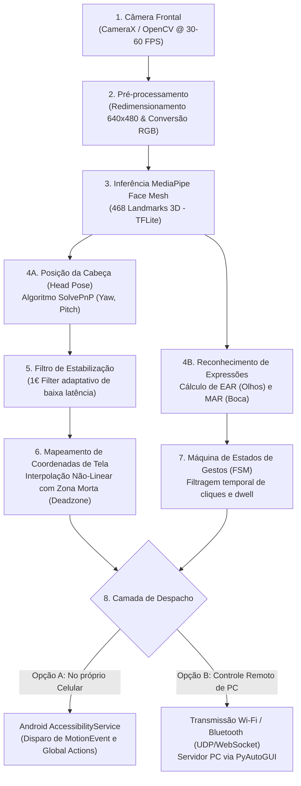

# Estudo e Projeto: Reconhecimento Facial como Mouse Assistivo

> **Área:** Tecnologia Assistiva, Interação Humano-Computador (IHC) e Visão Computacional de Borda  
> **Objetivo:** Documento técnico-científico detalhando a fundamentação matemática, algoritmos, arquitetura de software, métricas de usabilidade e diretrizes para apresentação de seminário ou desenvolvimento de TCC/Iniciação Científica.

---

## 🧭 Índice do Documento
1. [Visão Geral e Relevância Social](#1-visão-geral-e-relevância-social)
2. [Estado da Arte e Soluções Existentes](#2-estado-da-arte-e-soluções-existentes)
3. [Fundamentação Matemática e Algorítmica](#3-fundamentação-matemática-e-algorítmica)
   - [Estimativa de Pose da Cabeça (Head Pose via PnP)](#31-estimativa-de-pose-da-cabeça-head-pose-estimation)
   - [Detecção de Piscada via Eye Aspect Ratio (EAR)](#32-detecção-de-piscadas-e-cliques-eye-aspect-ratio---ear)
   - [Filtros de Suavização: 1€ Filter vs. Filtro de Kalman](#33-filtragem-de-ruído-e-estabilização-1-filter-vs-kalman)
4. [Arquitetura do Pipeline em Tempo Real](#4-arquitetura-do-pipeline-em-tempo-real)
5. [Protocolo Experimental e Métricas Científicas (Lei de Fitts)](#5-protocolo-experimental-e-métricas-científicas)
6. [Análise Crítica e Limitações Práticas](#6-análise-crítica-e-limitações-práticas)
7. [Roteiro de Seminário Acadêmico (Alinhado às 10 Diretrizes)](#7-roteiro-de-seminário-acadêmico)
8. [Referências Bibliográficas Seminais](#8-referências-bibliográficas-seminais)

---

## 1. Visão Geral e Relevância Social

Pessoas com limitações motoras severas nos membros superiores (decorrentes de tetraplegia, esclerose lateral amiotrófica - ELA, paralisia cerebral ou amputações) enfrentam barreiras intransponíveis no uso de dispositivos convencionais (mouse e teclado).

A Visão Computacional aplicada como **tecnologia assistiva** transforma a câmera frontal de um smartphone ou webcam comercial em um dispositivo de apontamento de alta precisão sem a necessidade de sensores corporais invasivos ou hardware proprietário de custo proibitivo.

---

## 2. Estado da Arte e Soluções Existentes

| Solução | Plataforma | Tipo de Código | Mecanismo Central de Rastreamento | Estratégia de Clique |
| :--- | :--- | :--- | :--- | :--- |
| **Google Project Gameface** | Windows / Android | Aberto (Open Source) | MediaPipe Face Mesh (468 landmarks + blendshapes) | Expressões faciais (levantar sobrancelha, abrir boca) ou tempo de parada (*dwell*) |
| **EVA Facial Mouse** | Android | Gratuito | Rastreamento óptico de fluxo facial via OpenCV/Nativo | Movimento relativo da cabeça + *Dwell click* (pausa sobre o ícone) |
| **Enable Viacam (eViacam)** | Windows / Linux | Aberto (GPL) | Optical Flow sobre a face ou nariz | Movimento contínuo + clique por tempo de repouso ou atalho |
| **Face Control** | Android | Aberto | Rastreamento facial integrado ao Android Accessibility Service | Gestos de cabeça e expressões |

---

## 3. Fundamentação Matemática e Algorítmica

Para que o trabalho tenha rigor científico, o grupo não deve apenas chamar métodos prontos de biblioteca, mas formalizar as equações matemáticas subjacentes:

### 3.1 Estimativa de Pose da Cabeça (Head Pose Estimation)
O cálculo da orientação da cabeça em 3D utiliza o algoritmo **Perspective-n-Point (PnP)**, que resolve a correspondência entre pontos anatômicos conhecidos em um modelo facial 3D padrão ($X_w, Y_w, Z_w$) e suas projeções 2D no plano da imagem ($u, v$):

$$\begin{bmatrix} u \\ v \\ 1 \end{bmatrix} = \mathbf{K} \begin{bmatrix} \mathbf{R} & \mathbf{t} \end{bmatrix} \begin{bmatrix} X_w \\ Y_w \\ Z_w \\ 1 \end{bmatrix}$$

Onde:
* $\mathbf{K}$ é a matriz de calibração intrínseca da câmera (distância focal $f_x, f_y$ e ponto principal $c_x, c_y$);
* $\mathbf{R}$ é a matriz ortogonal de rotação $3 \times 3$;
* $\mathbf{t}$ é o vetor de translação $3 \times 1$.

A partir da matriz de rotação $\mathbf{R}$ (ou usando a fórmula de Rodrigues), extraem-se os **Ângulos de Euler**:
* **Yaw ($\psi$):** Rotação horizontal (olhar esquerda/direita) $\rightarrow$ Mapeado para o eixo $X$ da tela;
* **Pitch ($\theta$):** Rotação vertical (olhar cima/baixo) $\rightarrow$ Mapeado para o eixo $Y$ da tela;
* **Roll ($\phi$):** Inclinação lateral (ombro a ombro) $\rightarrow$ Usado para compensação e descarte de ruído.

---

### 3.2 Detecção de Piscadas e Cliques: Eye Aspect Ratio (EAR)
Para evitar que piscadas naturais involuntárias disparem cliques acidentais, utiliza-se a métrica seminal de **Soukupová e Čech (2016)**, o *Eye Aspect Ratio* (EAR):

$$\text{EAR} = \frac{||p_2 - p_6|| + ||p_3 - p_5||}{2 \cdot ||p_1 - p_4||}$$

Onde $p_1, \dots, p_6$ são os 6 pontos de referência (landmarks) do contorno palpebral fornecidos pelo MediaPipe Face Mesh.

```
         p2       p3
         •--------•
   p1 •              • p4     (Olho Aberto: EAR ≈ 0.30 - 0.35)
         •--------•           (Olho Fechado: EAR < 0.18)
         p6       p5
```

* **Lógica de Disparo de Clique:**
  * Piscada involuntária: $\text{EAR} < 0.18$ por menos de $150\text{ ms}$ (desconsiderada pelo sistema).
  * Clique deliberado com botão esquerdo: $\text{EAR}_{\text{esquerdo}} < 0.18$ mantido entre $250\text{ ms}$ e $500\text{ ms}$.
  * Clique com botão direito ou duplo clique: Fechamento sincronizado de ambos os olhos ou abertura sustentada da boca (*Mouth Aspect Ratio* - MAR).

---

### 3.3 Filtragem de Ruído e Estabilização: 1€ Filter vs. Kalman
O movimento da cabeça humana apresenta **micromovimentos involuntários de alta frequência (tremor/jitter)** em repouso. No entanto, filtros simples de média móvel introduzem **atraso perceptível (lag)** durante movimentos rápidos.

A solução de ponta para IHC é o **1€ Filter (One Euro Filter - Casiez et al., 2012)**, um filtro passa-baixa de primeira ordem com frequência de corte adaptativa:

$$\hat{X}_k = \alpha_k X_k + (1 - \alpha_k) \hat{X}_{k-1}, \quad \text{onde } \alpha_k = \frac{1}{1 + \frac{\tau_k}{T_e}}$$

A frequência de corte $f_c$ varia dinamicamente em função da velocidade instantânea calculada do cursor ($\dot{X}_k$):

$$f_c = f_{c,\min} + \beta \cdot |\dot{X}_k|$$

* **Em repouso ($|\dot{X}_k| \approx 0$):** $f_c$ aproxima-se de $f_{c,\min}$ (ex: $1.0\text{ Hz}$), eliminando completamente o tremor na hora de clicar em botões pequenos.
* **Em movimento rápido ($|\dot{X}_k| \gg 0$):** $f_c$ cresce proporcionalmente com o coeficiente de velocidade $\beta$, reduzindo o atraso (lag) a praticamente zero.

---

## 4. Arquitetura do Pipeline em Tempo Real



---

## 5. Protocolo Experimental e Métricas Científicas

Para transformar o projeto em um artigo científico aceito em congressos (como SIBGRAPI, IHC ou Simpósio Brasileiro de Informática na Educação), o grupo deve conduzir experimentos controlados baseados no padrão internacional **ISO 9241-9**:

### 1. Teste de Apontamento com a Lei de Fitts
A Lei de Fitts modela matematicamente o tempo de movimento ($MT$) para atingir um alvo na tela em função da distância ($D$) e da largura do alvo ($W$):

$$MT = a + b \cdot \text{ID}, \quad \text{onde } \text{ID} = \log_2\left(\frac{2D}{W}\right) \text{ (Índice de Dificuldade em bits)}$$

* **Throughput (TP em bits/segundo):**
  $$TP = \frac{\text{ID}_e}{MT}$$
  Permite comparar com precisão matemática a eficiência do mouse facial contra mouses convencionais, trackpads e eye-trackers comerciais.

### 2. Métricas de Desempenho e Engenharia
* **Taxa de Erro de Clique (Click Error Rate - CER):** Percentual de cliques disparados fora da área demarcada do botão alvo.
* **Latência Fim a Fim (End-to-End Latency):** Tempo em milissegundos desde a captura do frame de luz pelo sensor CMOS da câmera até a atualização do pixel do cursor na tela (meta ideal: $< 35\text{ ms}$).
* **Consumo Energético e Térmico:** Degradação de bateria (% por hora de uso contínuo) e temperatura da CPU móvel.

---

## 6. Análise Crítica e Limitações Práticas

*(Ponto crucial para a seção de Discussão do seminário e banca)*

1. **Fadiga Muscular Cervical (*Neck Strain*):**
   * Usar a cabeça como mouse por mais de 30 minutos contínuos pode causar dores no pescoço. O sistema **não deve** exigir grandes amplitudes angulares. Recomenda-se implementar aceleração dinâmica (curva de sensibilidade sigmoide) para cobrir toda a tela com apenas $\pm 5^\circ$ a $\pm 10^\circ$ de inclinação cefálica.
2. **Robustez a Variações de Iluminação:**
   * Em ambientes escuros ou com iluminação traseira forte (luz solar na janela atrás da pessoa), os pontos do MediaPipe perdem precisão. Uma solução é implementar equalização adaptativa de histograma (CLAHE) no pré-processamento.
3. **Oclusões Físicas:**
   * Óculos de grau grosso com reflexos, armações pesadas ou barbas volumosas podem deslocar a predição dos landmarks labiais e perioculares.
4. **Privacidade:**
   * Como a câmera frontal fica ligada continuamente, usuários têm receio de espionagem. O artigo deve enfatizar a garantia arquitetural de **privacidade em borda**: nenhum frame de vídeo é gravado ou enviado para servidores em nuvem; os pixels são processados exclusivamente na memória RAM volátil e descartados imediatamente.

---

## 7. Roteiro de Seminário Acadêmico

Se o grupo optar por apresentar um artigo científico desta área, estruture os slides no roteiro abaixo:

1. **Identificação:** Título do trabalho acadêmico de referência (ex: Turkyilmaz & Kaçar, 2019 ou Perini et al., 2021).
2. **Objetivo:** Universalizar o acesso digital de indivíduos com tetraplegia através de hardware comum de baixo custo.
3. **Introdução:** Panorama da acessibilidade motora; o custo proibitivo dos mouses oculares com infravermelho ($> \$3.000$ USD).
4. **Metodologia (Visão):** Demonstração dos 468 pontos do MediaPipe Face Mesh e a matemática do algoritmo PnP.
5. **Metodologia (IHC e Controle):** A fórmula do Eye Aspect Ratio (EAR) e o filtro 1€ Filter resolvendo o conflito entre tremor e latência.
6. **Resultados:** Comparativo de tempos de tarefa em tarefas de clique e digitação em teclado virtual.
7. **Discussão:** Comparativo com soluções existentes (Project Gameface do Google e EVA Facial Mouse).
8. **Conclusão:** Viabilidade técnica de aplicações de acessibilidade de tempo real sem GPUs dedicadas.
9. **Opinião do Grupo:** Análise da ergonomia, necessidade de zonas mortas de descanso para a cabeça e respeito à privacidade local.
10. **Referências:** Citação dos trabalhos seminais de Soukupová, Casiez e da documentação do MediaPipe.

---

## 8. Referências Bibliográficas Seminais

* CASIEZ, Géry; ROUSSEL, Nicolas; VOGEL, Daniel. **1€ filter: a simple speed-based low-pass filter for noisy input in interactive systems**. In: *Proceedings of the SIGCHI Conference on Human Factors in Computing Systems*. 2012. p. 2527-2530.
* SOUKUPOVÁ, Tereza; ČECH, Jan. **Real-time eye blink detection using facial landmarks**. In: *21st Computer Vision Winter Workshop (CVWW)*. 2016. p. 1-8.
* TURKYILMAZ, Ibrahim; KAÇAR, Fatih. **Design and implementation of a facial gesture-based human-computer interface for disabled people**. *Biomedical Signal Processing and Control*, v. 51, p. 306-315, 2019.
* PERINI, Lucas et al. **Evaluation of head-tracking pointing devices under the ISO 9241-9 standard**. *Universal Access in the Information Society*, v. 20, p. 115-127, 2021.
* LUGARESI, Camillo et al. **MediaPipe: A framework for building perception pipelines**. *arXiv preprint arXiv:1906.08172*, 2019.
