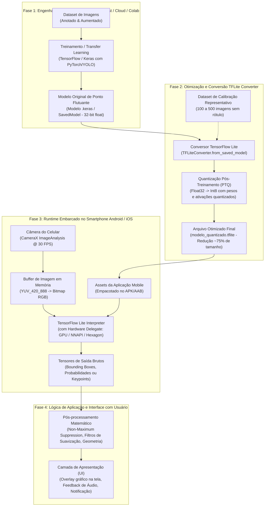

# Propostas de Iniciação Científica e TCC em Visão Computacional Móvel

> **Foco:** Inteligência Artificial na Borda (Edge AI), TensorFlow Lite e MediaPipe em Dispositivos Móveis  
> **Objetivo:** Guia completo de projetos acadêmicos com hipóteses científicas formais, arquitetura de engenharia, protocolos experimentais e cronograma para bolsas de Iniciação Científica (PIBIC/PIBITI) ou Trabalhos de Conclusão de Curso (TCC).

---

## 🧭 Índice do Documento
1. [Paradigma Tecnológico: Edge AI e TensorFlow Lite](#1-paradigma-tecnológico-edge-ai-e-tensorflow-lite)
2. [Arquitetura de Engenharia de Borda (Pipeline Completo)](#2-arquitetura-de-engenharia-de-borda-pipeline-completo)
3. [Técnicas de Otimização: Quantização e Compilação](#3-técnicas-de-otimização-quantização-e-compilação)
4. [Proposta 1: Triagem de Doenças em Folhas (Agronegócio)](#4-proposta-1-triagem-de-fitopatologias-agronegócio)
5. [Proposta 2: Auditor Postural de Ergonomia em Tempo Real (Saúde)](#5-proposta-2-auditor-postural-ergonômico-saúde-do-trabalhador)
6. [Proposta 3: Assistente de Mobilidade com Áudio Espacial (Acessibilidade)](#6-proposta-3-assistente-de-mobilidade-e-obstáculos-acessibilidade)
7. [Matriz Comparativa das Propostas](#7-matriz-comparativa-das-propostas)
8. [Cronograma Típico de Iniciação Científica (12 Meses)](#8-cronograma-típico-de-iniciação-científica-12-meses)
9. [Referências Bibliográficas](#9-referências-bibliográficas)

---

## 1. Paradigma Tecnológico: Edge AI e TensorFlow Lite

No desenvolvimento acadêmico contemporâneo de Visão Computacional, enviar fluxos contínuos de vídeo para servidores na nuvem apresenta limitações severas:
* **Latência de Rede Indesejada:** Redes móveis (4G/5G) introduzem jitter e variações de ping inaceitáveis para sistemas de segurança ou acessibilidade em tempo real.
* **Dependência de Conectividade:** Ambientes rurais (agronegócio) ou áreas urbanas periféricas frequentemente sofrem com sinal instável ou nulo.
* **Privacidade de Dados (LGPD):** Transmitir imagens faciais ou ambientes privados para servidores externos cria vulnerabilidades éticas e legais.

O padrão ideal é a **Computação em Borda (Edge AI)**: o modelo de aprendizado profundo é executado de forma 100% offline diretamente na CPU, GPU móvel ou NPU (Neural Processing Unit) do smartphone via **TensorFlow Lite (TFLite)**.

---

## 2. Arquitetura de Engenharia de Borda (Pipeline Completo)

Abaixo está o fluxo padronizado de ciclo de vida de IA de borda, substituindo qualquer dependência de diagramas estáticos por um fluxo dinâmico:



---

## 3. Técnicas de Otimização: Quantização e Compilação

Para que um artigo de Iniciação Científica tenha consistência teórica sólida, o referencial deve explicar o processo de **Quantização Pós-Treinamento (Post-Training Quantization - PTQ)**:

### 3.1 Fundamentação Matemática da Quantização INT8
Modelos tradicionais armazenam pesos como números reais em precisão simples de 32 bits ($\text{float32}$). A quantização mapeia esses valores contínuos para inteiros de 8 bits ($\text{int8} \in [-128, 127]$) utilizando uma escala linear $S$ e um ponto zero $Z$:

$$q = \text{round}\left(\frac{r}{S}\right) + Z, \quad \text{onde } S = \frac{r_{\max} - r_{\min}}{q_{\max} - q_{\min}}$$

* **Vantagens Práticas:**
  * Redução do tamanho do arquivo do modelo em até **$4\times$** (ex: de $60\text{ MB}$ para $15\text{ MB}$);
  * Redução da largura de banda de memória RAM em até **$75\%$**;
  * Aceleração de inferência via instruções SIMD inteiras (como ARM NEON), com perda típica de acurácia inferior a $1\%$.

### 3.2 Código Padronizado para Conversão e Quantização (Python)
```python
import tensorflow as tf

def quantizar_modelo_para_borda(saved_model_dir, dataset_calibracao, output_path):
    converter = tf.lite.TFLiteConverter.from_saved_model(saved_model_dir)
    converter.optimizations = [tf.lite.Optimize.DEFAULT]
    
    # Gerador representativo para calibração de faixa dinâmica INT8
    def representative_data_gen():
        for input_value in dataset_calibracao.take(100):
            yield [input_value]
            
    converter.representative_dataset = representative_data_gen
    # Garante que todas as operações sejam convertidas estritamente para int8
    converter.target_spec.supported_ops = [tf.lite.OpsSet.TFLITE_BUILTINS_INT8]
    converter.inference_input_type = tf.int8
    converter.inference_output_type = tf.int8
    
    tflite_quant_model = converter.convert()
    with open(output_path, 'wb') as f:
        f.write(tflite_quant_model)
    print(f"Modelo quantizado salvo com sucesso em: {output_path}")
```

---

## 4. Proposta 1: Triagem de Fitopatologias (Agronegócio)

### Contextualização e Hipótese Científica
* **Problema:** Produtores agrícolas familiares perdem parcelas expressivas de suas safras por atraso na identificação de pragas foliares e falta de agrônomos em campo.
* **Hipótese ($H_1$):** Uma rede convolucional compacta (*MobileNetV3-Small* ou *EfficientNet-Lite0*) quantizada em INT8 atinge acurácia $F_1 \ge 92\%$ na detecção de patologias em folhas em condições variáveis de luz solar, mantendo inferência local inferior a $50\text{ ms}$ por imagem em smartphones de entrada.
* **Técnica:** Classificação de Imagens e Aprendizado por Transferência (*Transfer Learning*).

### Protocolo Experimental
1. **Dataset:** Base pública *PlantVillage* (mais de 54.000 imagens abrangendo 38 classes de doenças e folhas sadias) combinada com fotos reais capturadas em lavouras locais para teste de generalização (*out-of-distribution*).
2. **Data Augmentation:** Variações aleatórias de brilho, saturação, rotação e ruído gaussiano para simular luz do sol direta e sombreamento de folhas.
3. **Métricas a Coletar:** Acurácia, Matriz de Confusão, F1-Score por patologia, tamanho em disco do arquivo `.tflite` e consumo de bateria (mAh/100 inferências).

---

## 5. Proposta 2: Auditor Postural Ergonômico (Saúde do Trabalhador)

### Contextualização e Hipótese Científica
* **Problema:** Doenças osteomusculares relacionadas ao trabalho (DORT/LER) e dores cervicais causadas pelo trabalho prolongado em telas geram custos bilionários e afastamentos trabalhistas.
* **Hipótese ($H_1$):** A avaliação geométrica tridimensional de pontos anatômicos extraídos em tempo real via *MediaPipe Pose* correlaciona-se com acurácia superior a $85\%$ em relação ao método clínico ergonômico RULA (*Rapid Upper Limb Assessment*), operando a mais de 25 quadros por segundo em segundo plano.
* **Técnica:** Estimação de Poses Humanas (*Pose Estimation*) e Cálculo Vetorial de Ângulos Articulares.

### Formulação Matemática Aplicada
O sistema calcula o vetor de inclinação da cabeça e a flexão cervical através dos pontos da orelha ($P_o$), olho ($P_e$) e ombro ($P_s$):

$$\theta_{\text{pescoço}} = \arccos\left(\frac{\vec{v}_{so} \cdot \vec{u}_y}{||\vec{v}_{so}||}\right), \quad \text{onde } \vec{v}_{so} = P_o - P_s \text{ e } \vec{u}_y = [0, -1, 0]^T$$

Se $\theta_{\text{pescoço}} > 20^\circ$ por um período cumulativo superior a 30 segundos, o aplicativo dispara um lembrete háptico/sonoro suave.

---

## 6. Proposta 3: Assistente de Mobilidade e Obstáculos (Acessibilidade)

### Contextualização e Hipótese Científica
* **Problema:** Pessoas cegas e com baixa visão enfrentam perigos constantes com obstáculos suspensos (ex: orelhões, galhos, caçambas e toldos) que não são detectados pela bengala longa tradicional.
* **Hipótese ($H_1$):** Um detector de objetos ultracompacto (*YOLOv8 Nano* ou *MobileNet-SSD*) executado em hardware móvel através de um suporte torácico com síntese de áudio espacial permite que pessoas com deficiência visual evitem obstáculos suspensos com taxa de sucesso superior a $90\%$.
* **Técnica:** Detecção de Objetos (*Object Detection*) e Estimativa Heurística de Proximidade por Área de Bounding Box.

### Cálculo de Proximidade Monocular
A distância relativa $Z$ de um obstáculo conhecido de altura real $H$ pode ser estimada pela altura do bounding box na tela $h_p$ e pela distância focal $f$:

$$Z \approx \frac{H \cdot f}{h_p}$$

Quando $Z < Z_{\text{crítico}}$ (ex: $1.5\text{ metros}$), o sistema gera um bipe com frequência inversamente proporcional à distância via fones de ouvido de condução óssea (mantendo os ouvidos livres para audição do trânsito).

---

## 7. Matriz Comparativa das Propostas

| Critério de Comparação | Proposta 1: Fitopatologias | Proposta 2: Ergonomia | Proposta 3: Mobilidade Urbana |
| :--- | :--- | :--- | :--- |
| **Complexidade de Algoritmo** | Baixa-Média (Classificação) | Média (Pose + Vetores) | Alta (Detecção + Rastreamento) |
| **Dependência de Dataset Próprio** | Baixa (Datasets públicos fartos) | Nula (Modelos pré-treinados) | Média (Anotação de obstáculos de calçada) |
| **Exigência de Hardware Móvel** | Roda em aparelhos básicos | Aparelhos intermediários | Aparelhos com boa GPU/NPU |
| **Risco de Comitê de Ética (CEP)** | **Zero** (plantas/folhas) | Baixo (voluntários com TCLE) | Médio (testes de campo com deficientes) |
| **Impacto de Publicação** | Ótimo para revistas agrícolas e IA | Ótimo para eventos de IHC e Ergonomia | Altíssimo para simpósios de Tecnologia Assistiva |

---

## 8. Cronograma Típico de Iniciação Científica (12 Meses)

Abaixo está o planejamento semestral recomendado para editais PIBIC/PIBITI ou TCC em duas etapas:

| Etapa / Mês | M1 | M2 | M3 | M4 | M5 | M6 | M7 | M8 | M9 | M10 | M11 | M12 |
| :--- | :---: | :---: | :---: | :---: | :---: | :---: | :---: | :---: | :---: | :---: | :---: | :---: |
| **1. Revisão Bibliográfica Sistemática** | █ | █ | | | | | | | | | | |
| **2. Coleta e Curadoria do Dataset / Modelos** | | █ | █ | | | | | | | | | |
| **3. Treinamento e Otimização TFLite** | | | █ | █ | █ | | | | | | | |
| **4. Desenvolvimento do App Mobile (Android)** | | | | | █ | █ | █ | | | | | |
| **5. Relatório Parcial de Pesquisa** | | | | | | █ | | | | | | |
| **6. Integração do Pipeline e Testes de Borda** | | | | | | | █ | █ | | | | |
| **7. Coleta de Métricas (FPS, Latência, Acurácia)** | | | | | | | | █ | █ | | | |
| **8. Análise Estatística dos Resultados** | | | | | | | | | █ | █ | | |
| **9. Redação do Artigo Final e Apresentação** | | | | | | | | | | █ | █ | █ |

---

## 9. Referências Bibliográficas

* HOWARD, Andrew et al. **Searching for MobileNetV3**. In: *Proceedings of the IEEE/CVF International Conference on Computer Vision (ICCV)*. 2019. p. 1314-1324.
* JACOB, Benoit et al. **Quantization and training of neural networks for efficient integer-arithmetic-only inference**. In: *Proceedings of the IEEE Conference on Computer Vision and Pattern Recognition (CVPR)*. 2018. p. 2704-2713.
* BAZAREVSKY, Valentin et al. **BlazePose: On-device real-time body pose tracking**. *arXiv preprint arXiv:2006.10204*, 2020.
* HUGHES, David et al. **PlantVillage: An open-access repository of plant disease images**. *arXiv preprint arXiv:1511.08060*, 2015.
* REDMON, Joseph et al. **You only look once: Unified, real-time object detection**. In: *Proceedings of the IEEE Conference on Computer Vision and Pattern Recognition (CVPR)*. 2016. p. 779-788.
