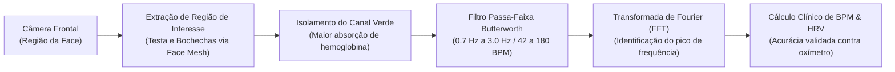

# Nichos Inexplorados em Visão Computacional de Borda

> **Para Trabalhos Científicos, TCCs e Iniciação Científica de Alto Impacto**  
> **Tese Central:** A verdadeira originalidade científica em nível de graduação e pós-graduação não exige inventar novos modelos matemáticos do zero (como criar um novo Transformer ou YOLO), mas sim aplicar arquiteturas consagradas a **problemas negligenciados pela grande indústria**, combinando IA de borda com formulações analíticas e regras de negócio especializadas.

---

## 🧭 Índice do Documento
1. [O "Filtro de Sobrevivência Acadêmica" (Alerta Crítico de CEP)](#1-o-filtro-de-sobrevivência-acadêmica-alerta-crítico-de-cep)
2. [Matriz Taxonômica dos 12 Nichos Inexplorados](#2-matriz-taxonômica-dos-nichos)
3. [Catálogo Detalhado de Nichos (Propostas 1 a 9)](#3-catálogo-detalhado-de-nichos)
4. [Novas Fronteiras e Ideias de Vanguarda (Propostas 10 a 12)](#4-novas-fronteiras-e-ideias-de-vanguarda)
5. [Roteiro de Validação e Engenharia de Borda](#5-roteiro-de-validação-e-engenharia-de-borda)
6. [Onde Publicar: Conferências e Periódicos Recomendados](#6-onde-publicar-conferências-e-periódicos)

---

## 1. O "Filtro de Sobrevivência Acadêmica" (Alerta Crítico de CEP)

> [!WARNING]
> **Cuidado com o Comitê de Ética em Pesquisa (CEP / Plataforma Brasil / CONEP):**  
> Um dos maiores erros de grupos de graduação é escolher temas que envolvem **seres humanos vulneráveis** (crianças com autismo, pacientes hospitalizados com feridas ou dados de saúde sensíveis) sem prever o tempo burocrático de submissão ao comitê de ética institucional. No Brasil, a tramitação de um projeto na Plataforma Brasil pode levar de **3 a 6 meses**, inviabilizando um seminário de semestre ou TCC semestral.

### Como navegar com segurança acadêmica:
1. **Opção de Risco Zero:** Escolha nichos focados em **objetos inanimados, animais, plantas, ferramentas industriais ou logística** (Nichos 2, 5, 7, 9, 10 e 11). Não há exigência de CEP.
2. **Opção de Baixo Risco (Interação Voluntária em IHC):** Projetos de usabilidade com colegas adultos e saudáveis testando mouse facial ou postura, onde se aplica apenas um Termo de Consentimento Livre e Esclarecido (TCLE) simplificado.
3. **Se quiser pesquisar Saúde Humana:** Utilize **exclusivamente datasets abertos de domínio público já anonimizados e aprovados previamente por comitês de ética** (ex: bases do Kaggle, PhysioNet, Medetec ou bases governamentais), citando expressamente a dispensa ética de uso secundário de dados anônimos.

---

## 2. Matriz Taxonômica dos Nichos

A tabela abaixo classifica todos os nichos propostos por complexidade técnica, ineditismo, risco burocrático e viabilidade de entrega:

| ID | Tema do Nicho | Complexidade Algorítmica | Ineditismo Acadêmico | Risco Ético (CEP) | Viabilidade em 1 Semestre | Stack Principal Recomendada |
| :---: | :--- | :---: | :---: | :---: | :---: | :--- |
| **1** | Tradutor Social para Autismo | Alta | Altíssimo | Alto (se testar com crianças) | Moderada | MediaPipe Mesh + LSTM / TFLite |
| **2** | Ergonomia Braçal (NIOSH / REBA) | Média-Alta | Alto | Baixo | Alta | MediaPipe Pose + Geometria 3D |
| **3** | Biometria por Dinâmica de Piscada | Alta | Alto | Baixo | Alta | MediaPipe Mesh + Análise de Séries Temporais |
| **4** | Auditoria de Feridas e Úlceras | Alta | Alto | Alto (se coletar em hospital) | Moderada | U-Net / MobileNetV3 + OpenCV |
| **5** | Guarda de Segurança para Ferramentas | Média | Muito Alto | Zero | Altíssima | MediaPipe Hands + Polígonos de Exclusão |
| **6** | Cinemática de Marcha Portátil | Alta | Alto | Baixo | Moderada | YOLOv8-Pose / MediaPipe + Biomecânica |
| **7** | Inventário por Varredura Contínua | Média-Alta | Moderado | Zero | Alta | ML Kit Barcode + Algoritmo SORT (Tracking) |
| **8** | Copiloto para Eletrodomésticos Legados| Média | Alto | Zero | Alta | OpenCV Contornos + TFLite OCR / TTS |
| **9** | Cubagem e Triagem de Logística Reversa| Média | Alto | Zero | Altíssima | Calibração A4 + Bounding Box 3D |
| **10**| Visão Baseada em Eventos (Neuromórfica)| Alta | Muito Alto | Zero | Moderada | Diferença Temporal $\Delta I$ + TFLite |
| **11**| Documentoscopia Anti-Fraude Offline | Alta | Alto | Zero | Alta | OpenCV Análise Especular + MobileNet |
| **12**| Monitor Cardíaco sem Contato (rPPG) | Alta | Altíssimo | Baixo | Moderada | Decomposição FFT do Canal Verde (RGB) |

---

## 3. Catálogo Detalhado de Nichos

### 1. Tradutor Dinâmico de Expressões e "Pistas Sociais" para Neurodivergentes (IHC / Saúde)
* **O Problema:** A maioria dos aplicativos assistivos para autismo foca em pranchas de comunicação alternativa estáticas. Há carência crítica em ferramentas de auxílio em tempo real para interpretação de pistas socioemocionais implícitas.
* **O Fator Inexplorado:** Em vez de mera classificação estática de "rosto feliz/triste", o sistema analisa **dinâmicas temporais** (desvio ocular cruzado com microexpressões labiais) para alertar sobre ironia, tédio ou sobrecarga sensorial do próprio usuário.
* **Técnica:** MediaPipe Face Mesh (extração de Blendshapes) integrado a uma rede temporal compacta (GRU/LSTM em TFLite).

---

### 2. Avaliador Automatizado de Ergonomia no Trabalho Operacional Braçal (Logística / Obras)
* **O Problema:** Enquanto abundam apps para trabalhadores de escritório sentados, a ergonomia de operários carregando pesos em estoques e canteiros é ignorada ou auditada com formulários em papel.
* **O Fator Inexplorado:** O app traduz a **Equação de Carga do NIOSH** e a metodologia **REBA (Rapid Entire Body Assessment)** para vetores tridimensionais em tempo real, calculando o torque exercido no disco lombo-sacro (L5-S1) no instante do levantamento de peso.
* **Técnica:** MediaPipe Pose 3D no celular com projeção de planos e cálculo do ângulo sacro-lombar.

---

### 3. Autenticação Biométrica por "Dinâmica de Piscada" (Anti-Spoofing Ativo)
* **O Problema:** Provas de vida tradicionais (*liveness detection*) pedem sorrisos ou rotações de cabeça, mas já são vulneráveis a ataques de reapresentação por telas de alta resolução e deepfakes em tempo real.
* **O Fator Inexplorado:** Modelar a assinatura biomecânica neuromuscular do piscar palpebral individual (aceleração de fechamento, tempo de permanência e curva de reabertura).
* **Técnica:** Extração dos pontos perioculares com amostragem em alta taxa de quadros e classificação por Dynamic Time Warping (DTW) ou rede 1D-CNN.

---

### 4. Auditor Clínico de Feridas e Úlceras de Pressão (Home Care / Enfermagem)
* **O Problema:** A evolução de feridas crônicas (ex: pés diabéticos) é avaliada visualmente de forma empírica e subjetiva por enfermeiros.
* **O Fator Inexplorado:** Uso de um marcador geométrico adesivo de diâmetro milimétrico calibrado colado próximo à lesão. O app corrige a perspectiva da câmera, extrai a área exata em $\text{cm}^2$ e segmenta a proporção de tecido de granulação (vermelho/saudável) versus tecido necrótico (escuro/infeccioso).
* **Técnica:** Segmentação U-Net quantizada e colorimetria no espaço de cor Lab/HSV.

---

### 5. Guardião de Segurança para Ferramentas Estacionárias (Marcenarias e Oficinas)
* **O Problema:** Máquinas de corte perigosas (serras de fita, serras circulares de bancada e tupias) em pequenas oficinas causam amputações diárias por falta de sensores industriais caros.
* **O Fator Inexplorado:** O smartphone é montado em um tripé apontando para a lâmina. O operador demarca uma "zona virtual de perigo" na tela. Se o vetor da mão cruzar a linha com velocidade de aproximação perigosa, o app emite alarme ultrarrápido e aciona um relé Bluetooth para interromper o motor.
* **Técnica:** MediaPipe Hands (21 pontos 3D) com cálculo de vetor velocidade instantânea $\vec{v} = \Delta \mathbf{P} / \Delta t$.

---

### 6. Avaliador Cinemático de Marcha e Reabilitação Física Portátil (Fisioterapia)
* **O Problema:** Laboratórios de análise cinemática da marcha exigem câmeras infravermelhas com marcadores reflexivos que custam dezenas de milhares de dólares.
* **O Fator Inexplorado:** Análise da marcha monocular no plano sagital (perfil). O app mede automaticamente: comprimento do passo, cadência, tempos de fase de apoio e ângulos máximos de flexão do joelho e quadril.
* **Técnica:** Pose Estimation rodando a 30–60 FPS com validação estatística em relação ao padrão ouro biomecânico.

---

### 7. Sistema Integrado de Inventário por Varredura Contínua (Varejo / Estoques)
* **O Problema:** Bipar produtos um por um em almoxarifados é lento e sujeito a esquecimentos.
* **O Fator Inexplorado:** Varredura fluida em vídeo: a câmera do celular faz uma panorâmica na prateleira, detectando dezenas de códigos de barras, QR codes e caixas simultaneamente sem redundância.
* **Técnica:** Rastreamento temporal de objetos com algoritmo SORT / IOU Tracker associado ao Google ML Kit Barcode API.

---

### 8. Copiloto de Acessibilidade para Interfaces Físicas Legadas (Inclusão Digital)
* **O Problema:** Micro-ondas, máquinas de lavar e painéis prediais antigos possuem botões e displays digitais simples sem qualquer sintetizador de voz para deficientes visuais.
* **O Fator Inexplorado:** Cruzamento espacial: o app localiza os displays de sete segmentos via OCR e rastreia o dedo da pessoa, orientando por áudio espacial: *"Mova seu dedo 3 centímetros para a direita para alcançar o botão Iniciar"*.
* **Técnica:** OpenCV para segmentação de painéis + OCR local via TFLite + MediaPipe Hands.

---

### 9. Classificador e Cubador de Logística Reversa (Sustentabilidade e E-commerce)
* **O Problema:** Caixas e produtos devolvidos chegam com dimensões variadas e exigem medição manual de cubagem com fita métrica para cálculo de frete.
* **O Fator Inexplorado:** O objeto é posicionado sobre uma folha de papel A4 padrão (dimensão conhecida de $210 \times 297\text{ mm}$). O app corrige a homografia da imagem e projeta uma *Bounding Box 3D* que estima altura, largura e volume em segundos.
* **Técnica:** Geometria projetiva com OpenCV (Homografia e Matriz de Projeção) combinada com MobileNetV3 para classificação do estado do item.

---

## 4. Novas Fronteiras e Ideias de Vanguarda

Para grupos que buscam notas excepcionais com inovações alinhadas às tendências de 2026+:

### 10. Visão Computacional Neuromórfica Baseada em Eventos Simulada (Eficiência Energética Extrema)
* **Conceito:** Câmeras convencionais capturam matrizes completas de pixels (gastando muita bateria e CPU). Câmeras neuromórficas capturam apenas variações locais de iluminação ($\Delta I$).
* **Aplicação Acadêmica:** Criar um pré-processador de baixo custo no Android que calcula o fluxo de eventos simulado via subtração de quadros thresholded:
  $$\Delta I(x, y, t) = |I(x, y, t) - I(x, y, t-1)| > \theta$$
  Apenas os pixels ativos são repassados a uma rede esparsa, permitindo monitoramento de esteiras industriais com redução de **$90\%$ do consumo energético**.

---

### 11. Documentoscopia Digital Anti-Fraude em Borda (Prevenção de Golpes Offline)
* **Conceito:** Aplicativos de bancos digitais exigem envio de fotos de CNH/RG para servidores externos, expondo os dados a vazamentos e demorando segundos para validação.
* **Aplicação Acadêmica:** Realizar a verificação microscópica de padrões de segurança gráfica (hachuras, micro-letras e reflexo do holograma sob rotação guiada da câmera do aparelho) inteiramente de forma offline.

---

### 12. Fotopletismografia Remota de Borda (rPPG - Monitor Cardíaco sem Sensores Físicos)
* **Conceito:** Cada batimento cardíaco bombeia sangue para os capilares faciais, alterando sutilmente a absorção de luz no espectro verde do canal RGB.
* **Aplicação Acadêmica:** O usuário olha para a câmera frontal por 10 segundos. O app isola a região da testa e bochechas via Face Mesh, extrai a série temporal da intensidade do canal verde, aplica filtro passa-faixa Butterworth ($0.7 - 3.0\text{ Hz}$) e uma Transformada Rápida de Fourier (FFT), calculando os Batimentos Cardíacos por Minuto (BPM) e a Variabilidade da Frequência Cardíaca (HRV) para detecção de estresse ou sonolência veicular.

---

## 5. Roteiro de Validação e Engenharia de Borda

Independentemente do nicho escolhido, a estrutura do trabalho deve demonstrar rigor em três frentes:

1. **Eficiência de Computação Móvel:**
   * Apresentar gráficos comparando a taxa de quadros (FPS) em aparelhos de diferentes faixas de preço.
   * Evidenciar que o loop de processamento de imagens roda em uma thread assíncrona (como `Coroutines` no Kotlin ou `WebWorkers/Isolates`), mantendo a taxa de atualização da tela em 60 FPS estáveis.
2. **Avaliação Estatística Formal:**
   * Utilizar métricas padronizadas: Matriz de Confusão, Acurácia Balanceada, Erro Médio Absoluto (MAE) para valores contínuos e curvas Precision-Recall.
3. **Reproduzibilidade:**
   * Disponibilizar o código do treinamento e o modelo quantizado `.tflite` em repositório público (GitHub) com instruções de empacotamento.

---

## 6. Onde Publicar: Conferências e Periódicos Recomendados

| Evento / Periódico | Foco Temático | Nichos Ideais |
| :--- | :--- | :--- |
| **SIBGRAPI** (Conference on Graphics, Patterns and Images) | Visão Computacional de ponta e processamento de imagens | 2, 3, 6, 10, 12 |
| **IHC** (Simpósio Brasileiro sobre Fatores Humanos em Sistemas Computacionais) | Interação Humano-Computador, usabilidade e acessibilidade | 1, 5, 8 |
| **CBIS** (Congresso Brasileiro de Informática em Saúde) | Aplicações médicas, enfermagem e saúde digital | 4, 6, 12 |
| **ENIAC** (Encontro Nacional de Inteligência Artificial e Computacional) | Aplicações práticas de aprendizado de máquina e IA de borda | 2, 7, 9, 11 |
| **WVC** (Workshop de Visão Computacional) | Trabalhos de graduação e pós-graduação em visão aplicada | Todos os nichos |
| **IEEE Latin America Transactions** | Artigos completos de engenharia e computação aplicada | 2, 5, 7, 9 |
